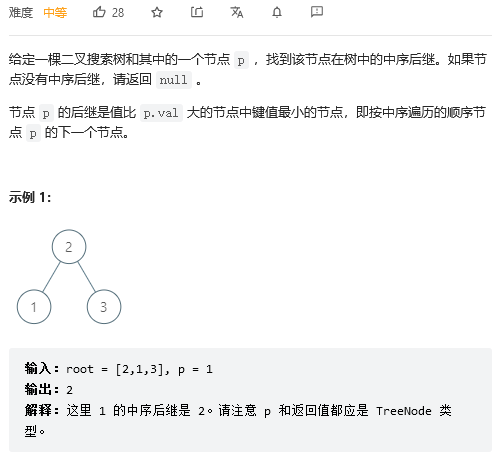

## 二叉搜索树的中序后继

二叉搜索树性质：
- 如果该树的左子树不为空，则左子树上所有节点的值都小于根节点的值
- 如果右子树不为空，则右子树上所有的节点的值都大于根节点
- 左右子树都是二叉搜索树

二叉搜索树的性质决定了，中序遍历的结果，是一个非递减排列。

所以，p点的中序后继的值，一定比p点的值大。

于是判断当前节点值：

如果当前节点的值小于p点的值，就要去当前节点的右子树寻找（右子树的值都比当前节点的值大）

如果当前节点的值大于p点的值，那么该节点可能是后继，也可能不是，不过先记录下来，继续去左子树找。
