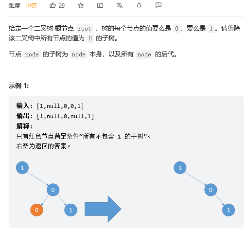

# 二叉树剪枝

应该算是简单题了，总是丢一点细节，导致找bug浪费时间。
我的方法是在递归遍历二叉树的过程执行剪枝，具体思路如下：
1. 如果当前节点的值为1，那么只有剪枝操作：
   1. 如果左子树为所有节点都是0的树，剪去左子树
   2. 如果右子树为所有节点都是0的树，剪去右子树
   3. 返回false，表明当前节点不是所有节点都为0的树
2. 如果当前节点的值为0，那么就有可能剪枝，有可能返回true
   1. 如果左子树和右子树都为Zero，那么返回true，表示当前节点是Zero
   2. 如果左子树是Zero，右子树不是Zero，剪去左子树
   3. 如果左子树不是Zero，右子树是Zero，剪去右子树

递归执行。