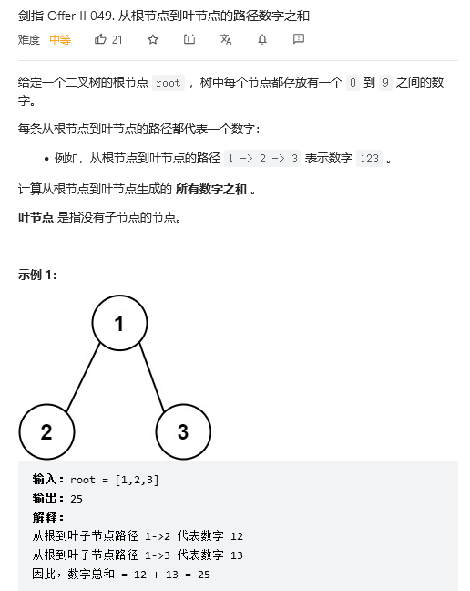

# 从根节点到叶节点的路径数字之和

这道题用栈或是用队列进行层序遍历，或是递归，都可以。
用栈的话，当所有叶子节点处理完后，栈内还有节点，这个时候怎么判断结束我没想出好方法。
用队列就好处理一些，思路比较清晰：

层序遍历：

使用哈希表存储当前节点的路径，用string表示，哈希表：`<节点，路径>`
1. 当前节点不是叶子节点，那么将左右子节点加入队列，同时在哈希表中加入该节点的路径。路径=当前节点路径+左/右子节点val。
2. 当前节点是叶子节点，从哈希表获取路径，parseInt成int类型，然后加到结果中。
   当队列结束，就完成了树的遍历，返回结果即可。

递归：
1. 递归输入：节点，上一个节点对应的路径值
2. 递归返回条件：当node为0时，返回0
3. 当前节点路径值 = 上一个节点的路径值 * 10 + 当前节点的值（val）
4. 如果当前节点是叶子节点，返回当前节点路径值
5. 如果不是叶子节点，返回：左子节点的路径值 + 右子节点路径值（子节点的路径值进入递归，继续计算）
