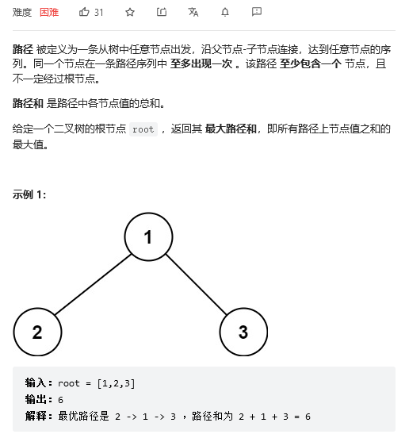

# 节点之和的最大路径

要计算最大路径和，必须遍历每个节点，才能得到结果。
二叉树的遍历，递归、层序，这个题目显然没法使用层序遍历，因为需要利用树的结构（路径）。

题目要求输出最大路径和，所以不需要记录节点，只需要在遍历过程中更新最大值即可。

递归遍历中，我们的关注点是，当前节点的左节点和右节点分别能给当前节点带来什么。
考虑一个最简单的树结构（1.当前节点，2.左节点 3.右节点），一个这样的树，最大路径和，有几种可能？

1. 当前节点（左右子节点都为负数时）
2. 左节点-->当前节点-->右节点
3. 左节点-->当前节点  或者  右节点-->当前节点

以上三种情况，在递归中，最大的值会被记录。

所以，我们需要左右节点给我们提供什么信息？ 
1. 单侧通过子节点的最大路径和（左节点-->当前节点  或者  右节点-->当前节点）
2. 通过子节点左右连线的最大路径和（左节点-->当前节点-->右节点）

如何更新当前节点的信息，然后返回给当前节点的父节点呢？
1. 单侧通过当前节点的最大路径和：
max(左节点单侧路径和+当前节点值，右节点单侧路径和+当前节点值， 当前节点值)
2. 左节点单侧路径和 + 当前节点值 + 右节点单侧路径和
3. 更新最大值：max(当前最大值， 左右连线路径和， 单侧路径和)