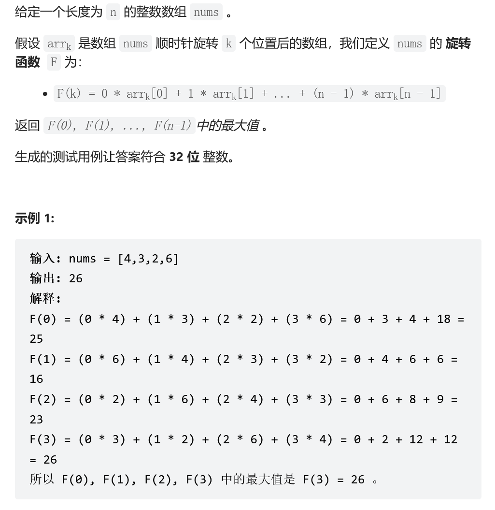

## 旋转函数

其实就是找规律：

例如，一个数组，四个元素：【1，2，3，4】

旋转0，1，2，3：
- 1 * 0___2 * 1___3 * 2___4 * 3
- 1 * 1___2 * 2___3 * 3___4 * 0
- 1 * 2 ___ 2 * 3___3 * 0___4 *  1
- 1 * 3___2 * 0___3 * 1___4 * 2
乘以0的是旋转数组的头部
发现，每次旋转，相当于除了头部外，其他元素都加了1.
那我们，把头部先加上，再减去，就相当于，每次旋转，都先加一个完整的初始数组和，再减去 当前头部元素*数组长度。